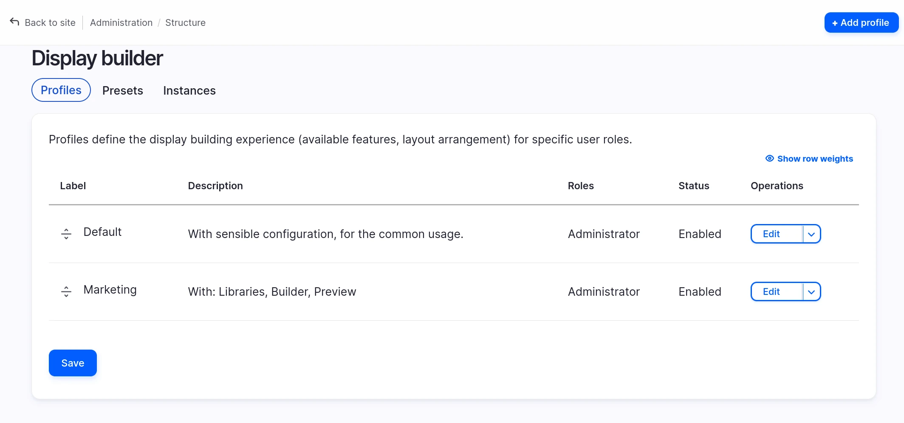
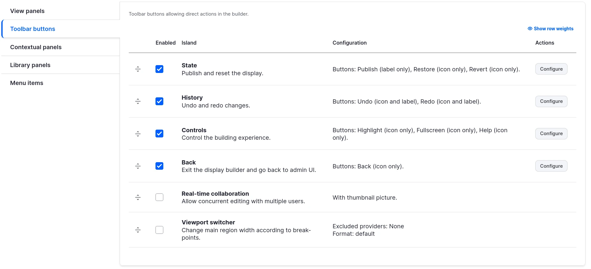
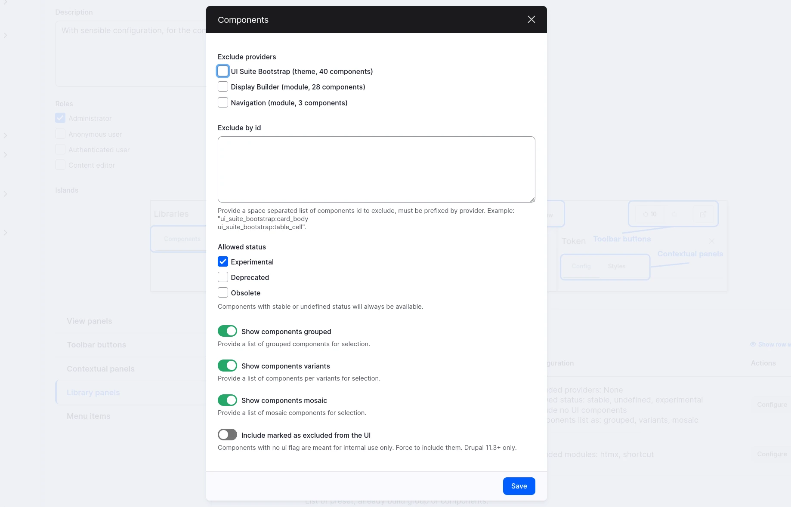
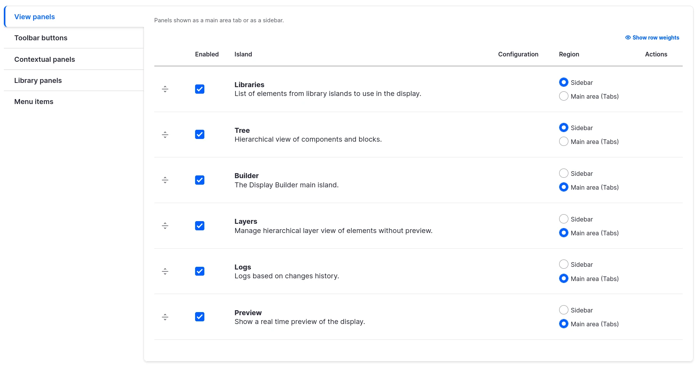
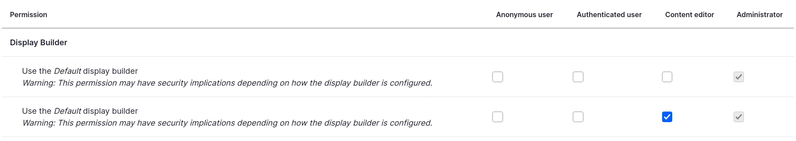
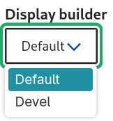

# Configuring

You need `display_builder_ui`.

Permissions:

- "Administer display builder"

## List of Display builder profiles

`/admin/structure/display-builder`

## Configuration of a single Display builder profile (config entity)

Each Display builder profile is a configuration entity with:

- Metadata: a label and a description
- The islands configuration, by type

There are 5 type of islands:

- `View` panels: They are displayed tabbed in the center of the toolbar, or as buttons in the start of the toolbar
- `Button`s: they a re displayed as buttons in the end of the toolbar
- `Library` panels: They are displayed tabbed into the Library View panel
- `Menu` items: they are displayed in the contextual menu triggered with right-click
- `Contextual` panels: They are displayed tabbed into the contextual sidebar

Visual positioning:

Each island can be:

- enabled or not
- ordered relatively to the other ones of a same type
- configured one by one

For example, here is the configuration of Toolbar buttons, where some are configurable:

Configuration happens in a modal:

View panels have an extra feature, they can be moved between 2 different regions:

- tabbed in the center of the toolbar
- or as buttons in the start of the toolbar

> 🚧 2025-11-05: This mechanism may be made generic. See [#3555920](https://www.drupal.org/i/3555920)

## Access & permissions

Each Display builder profile is associated to a permission:

This is conditioning the builders available in the selector for a specific user:

