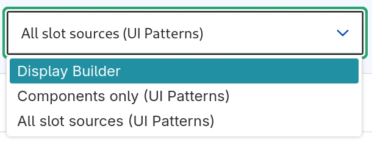

# Entity view displays overrides with Display builder

## Activate

You need `display_builder_entity_view` module and `ui_patterns_field` sub-module form [UI Patterns 2](www.drupal.org/project/ui_patterns) project.

Contrary to Layout Builder, there is no "Allow each content item to have its layout customize" checkbox in the "Manage display" and no "magic" field added to the content bundle.

You start by adding a "Source (UI Patterns)"

> 🚧 2025-07-01: Field description may change

It is better, but not mandatory, to chose unlimited number of value in field storage:

> 🚧 2025-07-01: Feature not implemented yet. [#3529125](https://www.drupal.org/project/display_builder/issues/3529125)

In "Manage form display", you can pick "Display builder":

## Use Display builder in the content

There are two different ways to use this feature:

### Override a full display

A mechanism similar to Layout Builder's overrides, but not limited to the default display.

TODO

> 🚧 2025-07-01: Feature not implemented yet. [#3529125](https://www.drupal.org/project/display_builder/issues/3529125)

### Use your content field in a slot

TODO

> 🚧 2025-07-01: Feature not implemented yet. [#3529125](https://www.drupal.org/project/display_builder/issues/3529125)
