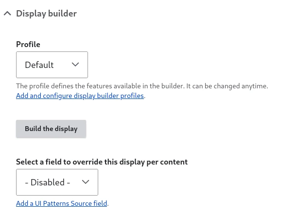
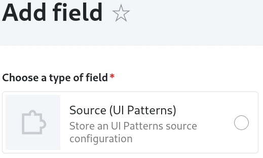
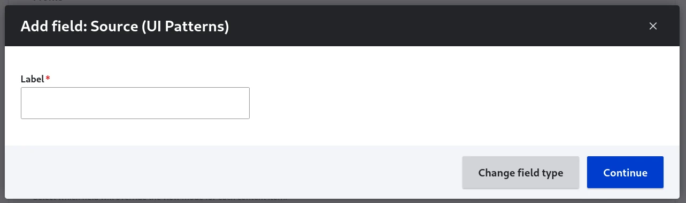
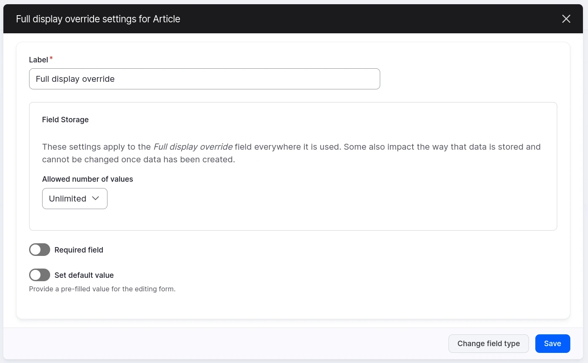

# Entity view displays overrides with Display builder

## Activate

You need `display_builder_entity_view` module and `ui_patterns_field` sub-module form [UI Patterns 2](www.drupal.org/project/ui_patterns) project.

Contrary to Layout Builder, there is no "Allow each content item to have its layout customize" checkbox in the "Manage display" and no "magic" field added to the content bundle.

You can assign a different configurable field to each display:



You can add a "Source (UI Patterns)" field using the usual Field UI:



> 🚧 2025-07-01: Field description may change

Or by clicking the "Add a UI Patterns Source field" link:



It is better, but not mandatory, to chose unlimited number of value in field storage:



Once the field is created, you can pick it to store the overrides:


It is not possible to pick the same field in different displays. You can also select the display builder profile the content editors will use.

## Use Display builder in the content

Any user with both the permission to edit the content and the one to use the display builder profile can override the display.

A mechanism similar to Layout Builder's overrides, but not limited to the default display.

If the user can override at least one display, a 'Display' tab id added in the content edit tabs:


If the user can override only one display, this tab is a direct link to this display. If the user can override many, a second row of tabs is visible:


The builder is a regular one with the same sources as Entity View Display plus some sources only available when editing a content:


The "Save" button store the display in the content field. The "Restore" button load the display from the content field.

> 🚧 2025-08-12: The revert button is still missing.

## Under the hood

Display Builder data is stored as content field provided by `ui_patterns_field` module, where every field item has those properties:

- `source_id`: the source plugin ID
- `source`: the source plugin config

The entity view display config entity has additional `override_field` and `override_display_builder` properties for the field name storing the data and the related display builder profile:

```yaml
id: node.article.default
targetEntityType: node
bundle: article
mode: default
content: {}
hidden: {}
third_party_settings:
  display_builder:
    display_builder: default
    sources: [...]
    override_field: field_full_display
    override_display_builder: default
```

Overview:


