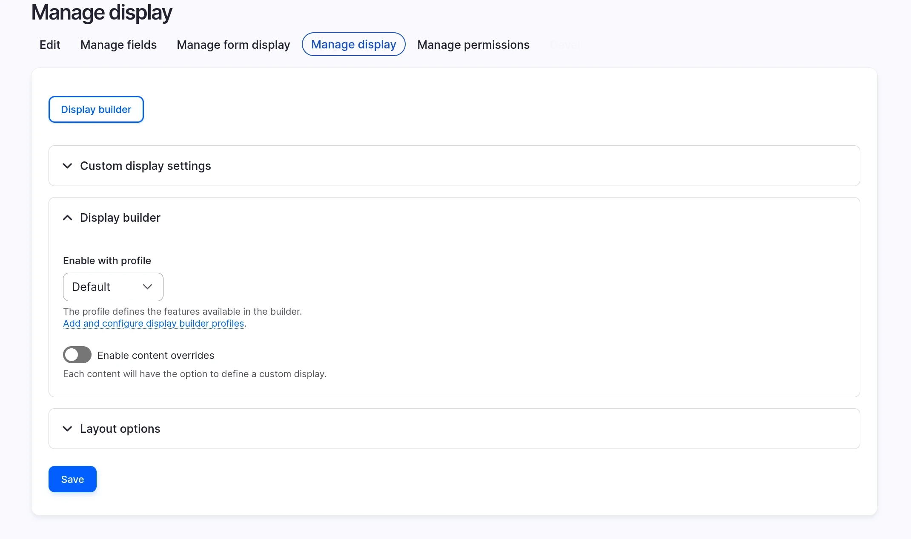
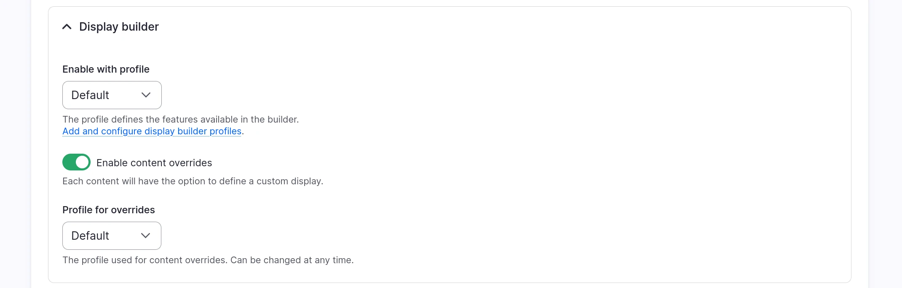
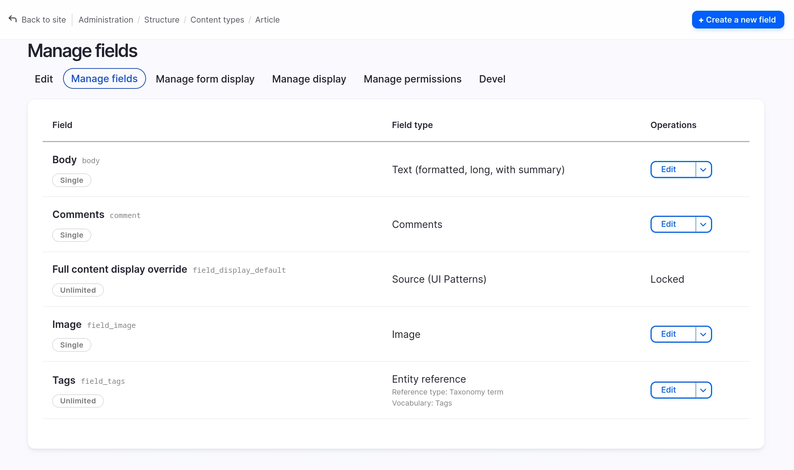
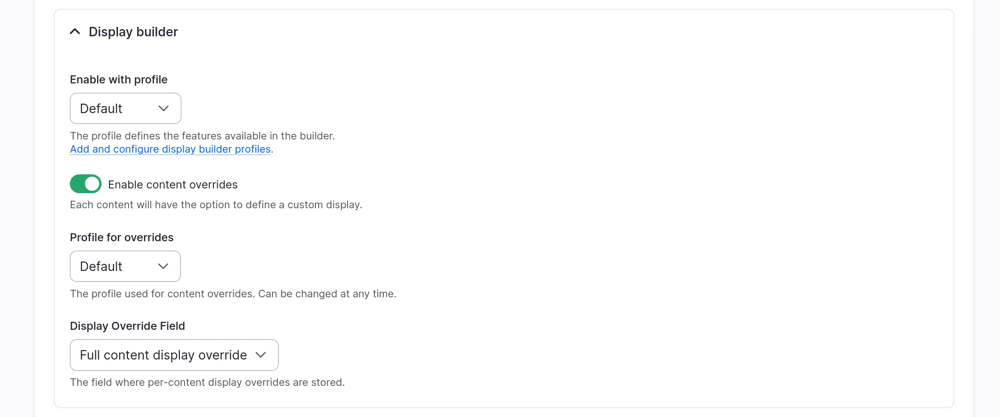
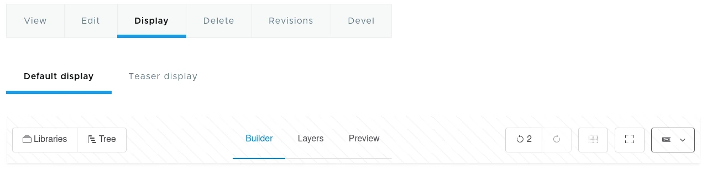
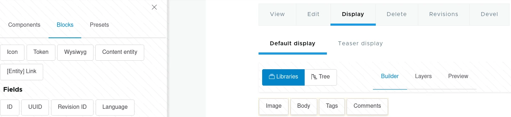

# Entity view displays overrides with Display Builder

> A page is assembled from several levels at once: a page layout places the
> page's main content. What fills it is a display: an entity's view display,
> or a Views display. A display can itself place another display, by
> rendering a reference field with a view mode.
>
> See [How displays nest](how-displays-nest.md).

## Activate

You need `display_builder_entity_view` module and `ui_patterns_field` sub-module from [UI Patterns 2](https://www.drupal.org/project/ui_patterns) project.

Contrary to Layout Builder, there is no "Allow each content item to have its layout customized" checkbox in the "Manage display" and no "magic" field added to the content bundle.

You can activate Content Overrides for each display:

On activation, you can pick the [Config Profile](configuration.md) the content editors will use:

A content field has been automatically created to store the overrides:

The field can be changed later:

The field cardinality is limiting the number of sources we can put at the display root level.

It is not possible to pick the same field in different displays.

## Use Display Builder in the content

Any user with both the permission to edit the content and the one to use the display builder profile can override the display.

A mechanism similar to Layout Builder's overrides, but not limited to the default display.

If the user can override at least one display, a *Display* tab is added in the content edit tabs:

If the user can override only one display, this tab is a direct link to this display. If the user can override many, a second row of tabs is visible:

The builder is a regular one with the same sources as Entity View Display plus some sources only available when editing a content:

The first time you open the override, it does not start blank. If the underlying display (the one picked when Content Overrides was activated) was itself built with Display Builder, its arrangement is copied in as the starting point, once, on the override's first creation. Only a display Display Builder never built, with nothing to copy, starts empty.

That copy is a one-time snapshot, not a live link: an override stores its own arrangement in its content field, independent of the underlying display from then on. Changing the underlying display later, even substantially, does not reach into or break an override that already exists.

The **Publish** button stores the display in the content field. The **Restore** button loads the display from the content field.

!!!tip
    Content editors can override the display once per configured display (default, teaser, etc.). This gives you granular control over how content appears in different contexts.

## See also

- [Entity view displays](entity-displays.md) - Base display configuration
- [Pattern presets](pattern-presets.md) - Save and reuse component arrangements
- [Migration from Layout Builder](migration-from-layout-builder.md) - Transition from Layout Builder overrides
