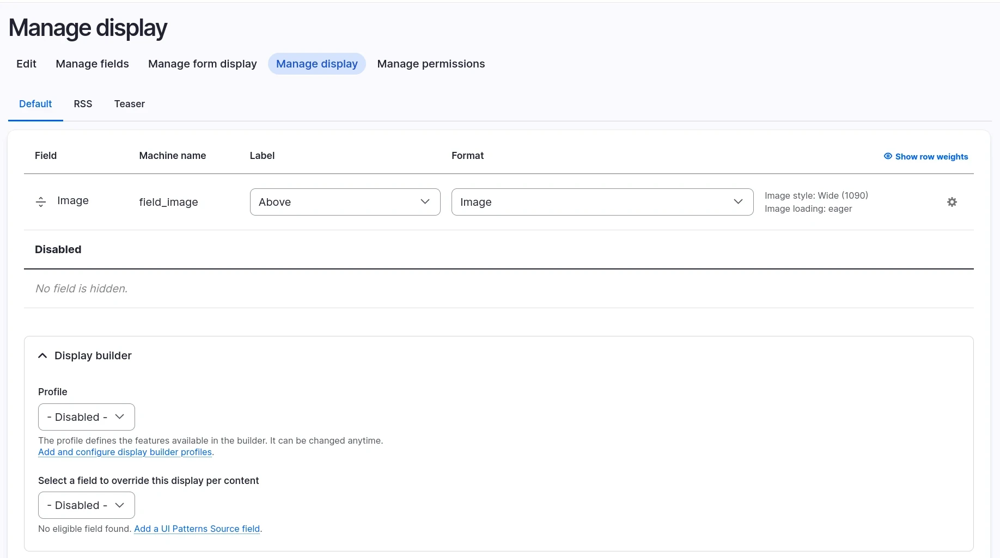
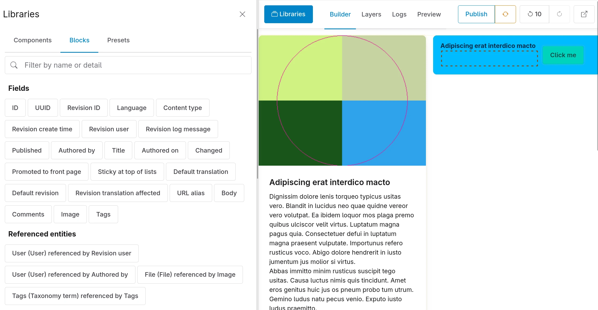
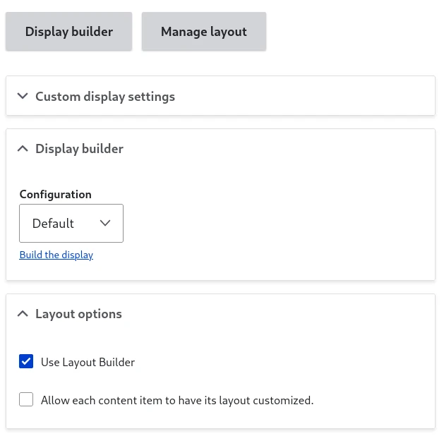
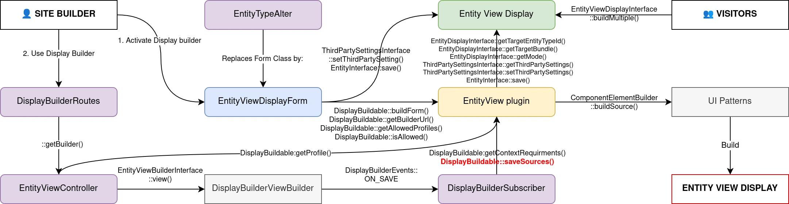

# Use Display Builder for entity view displays

As a replacement of Layout Builder and many modules from its ecosystem.

## Activate

You need `display_builder_entity_view` module.

Display builder can be activated for each display, in the "Display builder" fieldset:



## Use

Once yor Display builder selection is submitted, you will have access to twice the same link:

- The big "Display builder" button replacing the field formatter table
- A link under


Slot sources specific to the Entity Display context will show up in the "Block Library" panel:



Display Builder is saving every state in the memory, but is not auto-saving to the configuration.

You can manually save the current state in the configuration or restore the state currently saved in the configuration:


## Use with Layout Builder

Both can be activated at the same time and they don't conflict while building the display:



However, only one of the tool will be used to render the content.

## Under the hood

Display Builder data is stored as a third party settings with those properties:

- `display_builder`: the Display builder profile (config entity) in use last time the config was saved
- `sources`: a UI Patterns 2 sources tree

Example:

```yaml
id: node.article.default
targetEntityType: node
bundle: article
mode: default
content: {}
hidden: {}
third_party_settings:
  display_builder:
    display_builder: default
    sources: [...]
```

Overview:


