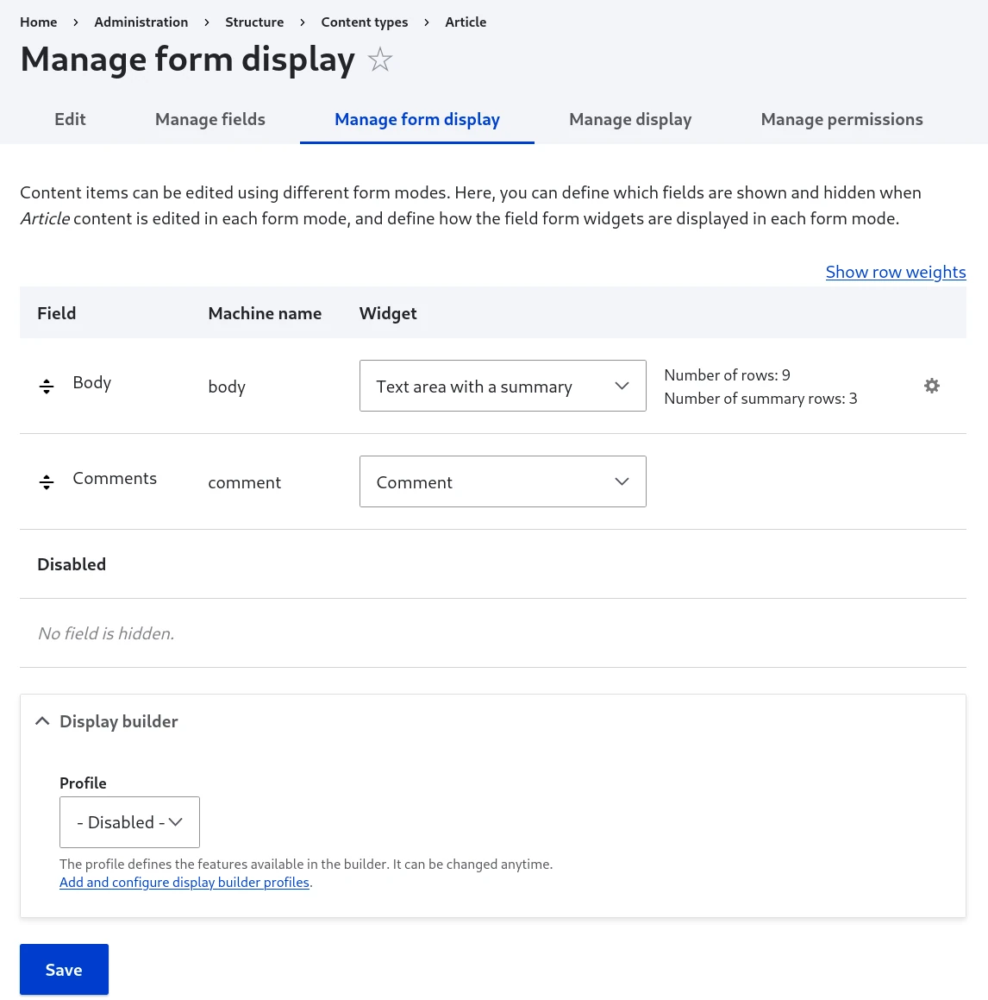
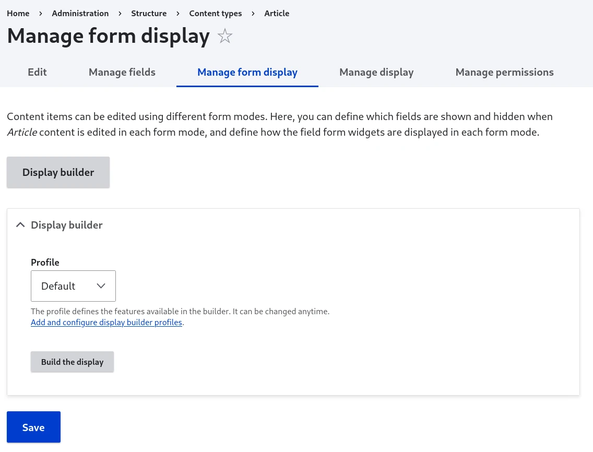
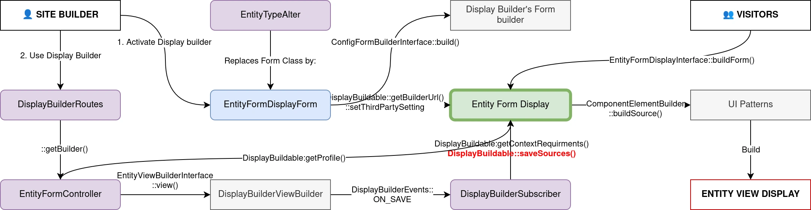

# Use Display Builder for entity form displays

## Activate

You need `display_builder_entity_form` module.

Display builder can be activated for each display, in the "Display builder" fieldset:



## Use

Once yor Display builder selection is submitted, you will have access to twice the same link:

- The big "Display builder" button replacing the field formatter table
- A link under



> 🚧 2025-09-11: Field widget sources not available yet.

You can manually save the current state in the configuration or restore the state currently saved in the configuration:


## Under the hood

Display Builder data is stored as a third party settings with those properties:

- `profile`: the Display builder profile (config entity) in use last time the config was saved
- `sources`: a UI Patterns 2 sources tree

Example:

```yaml
id: node.article.default
targetEntityType: node
bundle: article
mode: default
content: {}
hidden: {}
third_party_settings:
  display_builder:
    profile: default
    sources: [...]
```

Overview:


