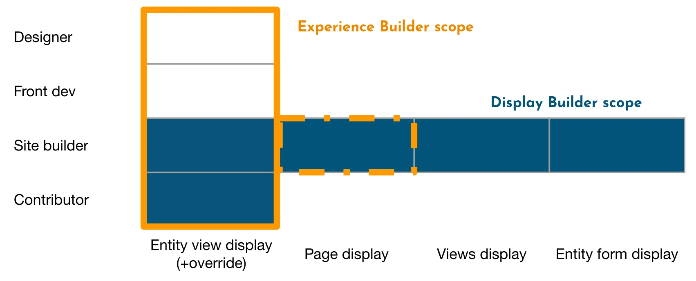

# Frequently Asked Questions

## Why my SDC component doesn't work well with Display Builder?

Display Builder is not doing anything anything specific with your SDC. It is only an user interface upon UI Patterns 2.

UI Patterns 2 is not expecting you to change your SDC component in order to be compatible.

However, if your component has definitions or templating issues, it will be harder for UI Patterns 2.x to connect it to Drupal API

You can check your component with [sdc_devel](https://www.drupal.org/project/sdc_devel) which provides automatic audits.

A component without error must be compatible with UI Patterns 2.x and Display Builder.

## Why my preprocess hook is not triggered anymore?

Display Builder is avoiding as much as possible to interact with `ThemeManager::render()`:

- By design, Entity View Display integration is sometimes bypassing `node.html.twig`, `user.html.twig`, `media.html.twig`, `field.html.twig`...
- By design, Page Layout integration is sometimes bypassing `page.html.twig` and `region.html.twig`
- By design, Views integration is sometimes bypassing `views-view.html.twig`, `views-view-field.html.twig`...

So, your preprocess and suggestions related to those templates will not be executed.

## What is the relationship with UI Patterns and UI Suite?

This is a display building tool made by a team specialized in design systems and display building since 2017: [UI Suite](https://www.drupal.org/project/ui_suite) people.

This project is new but it is only a thin layer upon APIs we are building for many years, and which are already used, tested and loved by many: [UI Patterns](https://www.drupal.org/project/ui_patterns).

## Is it related to Experience Builder?

Like Experience Builder, this project is a next generation display building tool for Drupal.

However, the 2 projects are different. Display Builder is currently targeting a wider **horizontal** scope (more display building coverage):

|                             | Experience Builder                   | Display Builder                                                   |
| --------------------------- | ------------------------------------ | ----------------------------------------------------------------- |
| Layout builder replacement  | ✅ Config & content overrides        | ✅ Config & content overrides with powerful data retrieval system |
| Page layout replacement     | ⚠️ Yes, but each region is a builder | ✅ Full page support                                              |
| View (displays) replacement | ⚠️ Is it still planned?              | ✅                                                                |
| Entity form modes           | ❌ Out of scope?                     | ✅ Planned                                                        |

But Experience Builder is currently targeting a deeper <strong>vertical</strong> scope (before and after display building):

|                            | Experience Builder            | Display Builder                         |
| -------------------------- | ----------------------------- | --------------------------------------- |
| Content editing            | ✅ the first use case covered | ⚠️ Yes, but not a central feature       |
| Component authoring        | ✅ as shown in DrupalCon NA   | ❌ Out of scope, we promote SDC instead |
| Designer tool (Figma-Lite) | ✅ Planned                    | ❌ Out of scope                         |

Visual explanation:

And they also differ by the technical and strategic choices. For example, Experience Builder is a complete ReactJS app, aside of Drupal, when Display Builder is just an usual Drupal module using HTMX.

So we are going in 2 different directions and our friendly competition will be only on the shared subset of our scopes. So, not such a big deal.

We hope both will be usable in a same project if this is needed by a team. Anyway, we are actively collaborating to provide same or compatible low level API and to improve Drupal Core together. So it is a win-win situation.

## Comparison with Layout Builder

### What is the equivalent of [Layout Builder Restrictions](https://www.drupal.org/project/layout_builder_restrictions)?

`layout_builder_restrictions` provides a configurable UI for restricting blocks and layouts. Sites can allow all options from a certain provider, or restrict all options by provider, or specify individual allowed blocks & layouts.

`layout_builder_restrictions_by_role` allows restricting what roles can place what blocks or use what layout (so, what component).

This is doable with Display Builder by creating different display builders by role and [to configure](configuration.md) the _Components library_ and _Block library panels_ differently.

### What is the equivalent of [Layout Builder Lock](https://www.drupal.org/project/layout_builder_lock)?

Layout Builder Lock allows administrators to lock sections of a default layout so users can't perform certain actions when overriding the layout for an individual entity.

This is doable with Display Builder by creating many _Component source_ and use them as "slots". See [Entity Display Overrides](entity-displays-overrides.md)
