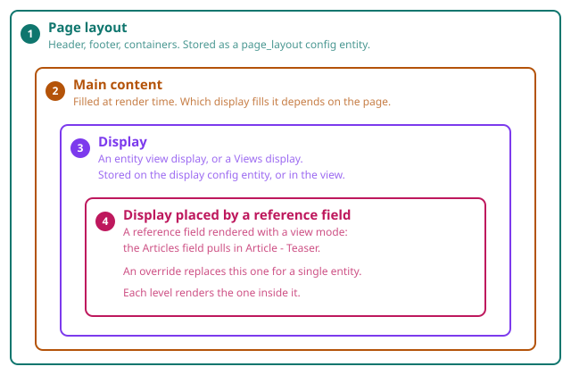

# How displays nest

A single page is assembled from more than one editable thing. Each one is
stored somewhere else and each one is edited in its own builder. When something
on the page looks wrong, the first question is not "how do I change it" but
"which of these owns it", and this page answers that.

## The four levels

1. **Page layout** owns the frame: header, footer, containers, and the slot
   where the page's main content goes.
2. **Main content** is filled at render time by an entity view display or a
   Views display. Which one depends on the page being visited.
3. A **display** can itself place another display, by rendering a reference
   field with a view mode. A landing page's Articles field pulls in
   *Article - Teaser*.
4. An **override** can replace step 3 for one entity only.

Three levels is normal. Four is reachable.

> A page layout places the page's main content. What fills it is a display: an
> entity's view display, or a Views display. A display can itself place another
> display, by rendering a reference field with a view mode.

## The vocabulary

Used in the interface, in these docs and in the Instances panel, always the
same way:

| Word | What it means |
|---|---|
| **page layout** | The page frame, bound to routes by conditions |
| **display** | An entity view display, or a Views display |
| **override** | A display replaced for one entity only |
| **renders** | The relation from a parent level to the level inside it |

One verb for that relation: a display **renders** another display. Not
"embeds", not "contains", not "uses".

## Nesting is Drupal's model, not this module's

Layout Builder has the identical chain, and so does a plain site with template
overrides: page template, node template, field template, referenced node
template. What changed is not the depth, it is the expectation. Once you can
click and edit one level directly, the levels you cannot click become
frustrating rather than invisible. The problem was made visible, not created.

Other builders nest too. Elementor Pro has Theme Builder templates plus Loop
Item templates; Webflow has components with instances. The real difference is
not depth, it is the cost of moving between levels.

**And the depth buys something.** A teaser edited once appears in fifty places.
A page builder without this would have you copy it fifty times. Reuse is the
payoff, navigation is the price.

## How to move between levels

**Build one display at a time. Use Preview to see how they assemble on a real
page.**

Three things do the navigating:

- **The Instances panel**, in the sidebar. Every display you can travel to,
  grouped by kind, with the current one marked. Displays that are not built with
  Display Builder yet are listed too, behind *Show not built yet*,
  because the chain you are chasing usually runs through one. They are hidden by
  default: a real site has several times more of them than built ones. Turn the
  box on and they appear, their name plain rather than a link, with a *Build*
  action that takes you to Manage display to enable Display Builder there.
- **The Config panel**, when you select a node that renders another display. It
  names the display and offers a link to it.
- **Preview**, which shows a display inside the page wrapper the site would
  really give it, so an entity or Views display previews with the real page
  around it.

## What a placeholder in the builder means

Some things on a page only exist while a real request is being served, so no
builder can show them. They appear as hatched placeholder boxes in both the
Canvas and the Preview, named after their job:

- **Main content**, in a page layout. Which display fills it depends on the page
  being visited, so it has no fixed content anywhere in the builder, Preview
  included.
- **Messages**, **Tabs**, **Action links**, **Breadcrumb** and **Help**. These
  answer "where am I and what just happened", which has no answer in a builder.

A placeholder is a real node: it can be selected, moved and deleted like
anything else. That is the point of showing one, rather than letting an element
that renders to nothing become invisible and unreachable.

## Editing another level in place is not supported

Clicking a teaser inside a page layout and editing it there is deliberately not
possible. It would mean nested builder state, saving into a different config
entity, a second permission model and a second undo stack.

Navigate to the level, edit it there, come back.

## Do not add page-level containers inside a display

A page layout owns the page frame: containers, grids, header and footer. A
display starts inside that frame, so it should not add page-level containers of
its own.

The most common cause of "why is there so much padding" is a display wrapping
itself in a container the page layout already provides. You can see it today:
Highlight outlines containers, and Scaffold renders layout components for real,
so a doubled container is visible without any extra tooling.
