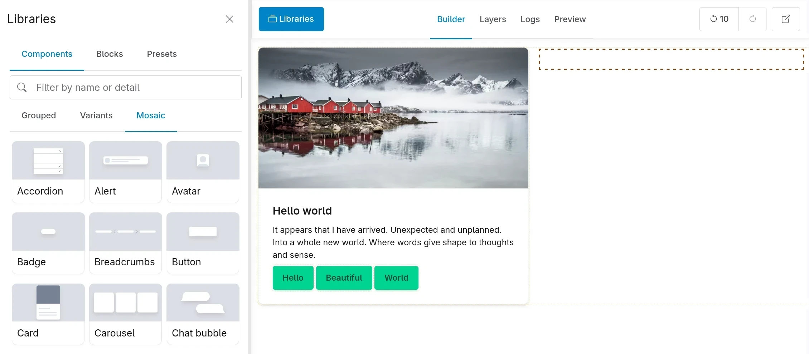

# Display Builder

A display building tool by the [UI Suite](https://www.drupal.org/project/ui_suite) team.

Display Builder provides sub-modules for each Drupal Core's display building need:

- [Entity view](entity-displays.md) and [entity view overrides](entity-displays-overrides.md) (`display_builder_entity_view`)
- [Page layout](page-layout.md) (`display_builder_page_layout`)
- [Views](with-views.md) (`display_builder_views`)

A page is assembled from several of these at once, each edited in its own
builder. Start with [How displays nest](how-displays-nest.md) to know which one
owns what.

Follow us on slack [#display_builder](https://drupal.slack.com/archives/C092EUNPCRW)

## For contributors

- [PHP Architecture](architecture.md) — SourceTree, event system, island plugin design
- [Contributing](contributing.md) — how to open issues and pull requests

## Maintainers

Current maintainers:

- Jean Valverde - Lead - [mogtofu33](https://www.drupal.org/u/mogtofu33)
- Mikael Meulle - Maintainer - [just_like_good_vibes](https://www.drupal.org/u/just_like_good_vibes)
- Pierre Dureau - Project manager - [pdureau](https://www.drupal.org/u/pdureau)

Supporting organizations:

- [Beyris](https://www.drupal.org/beyris) - We are leading impactful open-source
  projects and we are providing coding, training, audit and consulting.
