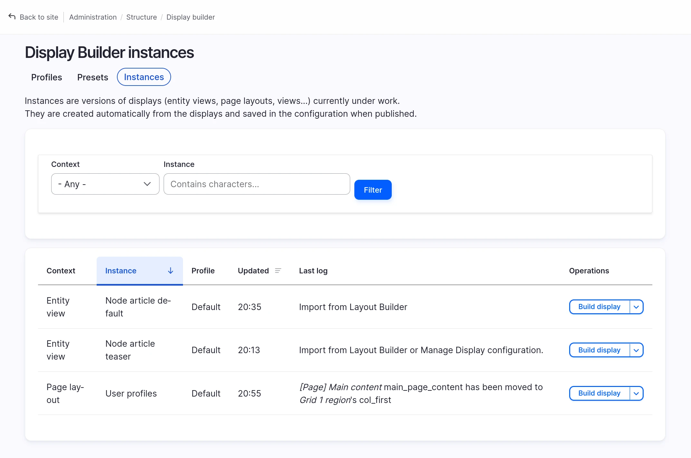

# Instances overview

You need `display_builder_ui` sub-module.

Instances are volatile storage for your current work. They store the current
drafts, the current revisions history, regardless of the published state of the
display.

They can be deleted without side-effects and are not expected to be synchronized
between environment.

!!!warning
    Instances are **temporary storage only**. They are automatically cleaned up
    during module updates. Always publish your display to save it permanently
    before updating.

You can access to an overview of the current instances:

With a quick access to the corresponding display builder.

## See also

- [Update guide](update.md) - How to handle module updates safely
- [Display Builder profiles](configuration.md) - Configure UI profiles
- [Internals](internals.md) - Learn how Display Builder stores data
