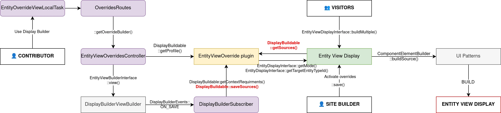
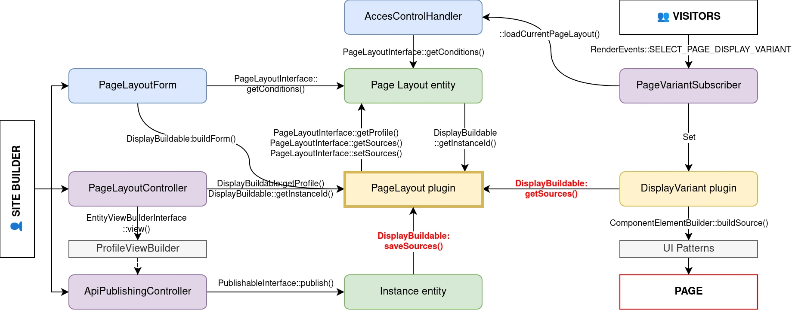
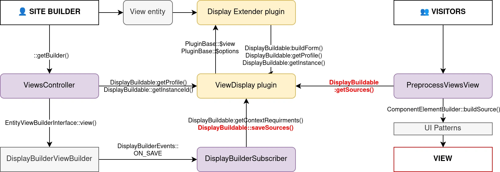

# Internals

## Entity displays

### Context management

Display Builder integration with Entity Displays is a `ContextProvider` for Source plugins:

| Context             | Type                   |
| ------------------- | ---------------------- |
| entity              | a fake "sample" entity |
| view_mode           | `string`               |
| bundle              | `string`               |
| context_requirement | "entity" literal       |

### Permanent storage

Display Builder data is stored as a third party settings in an EntityViewDisplay config entity, with those properties:

- `profile`: the Display Builder profile (config entity) in use last time the config was saved
- `sources`: a UI Patterns 2 sources tree

Example:

```yaml
id: node.article.default
targetEntityType: node
bundle: article
mode: default
content: {}
hidden: {}
third_party_settings:
  display_builder:
    profile: default
    sources: [...]
```

### Workflow

The communication between temporary and permanent storages is made by `entity_view` display buildable plugin.

Overview:


## Entity display overrides

### Context management

Display Builder integration with Entity Displays Overrides is a `ContextProvider` for Source plugins:

| Context             | Type                         |
| ------------------- | ---------------------------- |
| entity              | a fieldable content `entity` |
| view_mode           | `string`                     |
| bundle              | `string`                     |
| context_requirement | "content" literal            |

### Permanent storage

Display Builder data is stored as content field provided by `ui_patterns_field` module, where every field item has those properties:

- `node_id`: The ID of the node in the source tree
- `source_id`: the source plugin ID
- `source`: the source plugin config
- `third_party_settings`: extra configuration, prefixed by module or island plugin ID

The entity view display config entity has additional `override_field` and `override_profile` properties for the field name storing the data and the related Display Builder profile:

```yaml
id: node.article.default
targetEntityType: node
bundle: article
mode: default
content: {}
hidden: {}
third_party_settings:
  display_builder:
    profile: default
    sources: [...]
    override_field: field_full_display
    override_profile: default
```

### Workflow

The communication between temporary and permanent storages is made by `entity_view_override` display buildable plugin.

Overview:



## Page Layouts

### Context management

Display Builder integration with Page Layouts is a `ContextProvider` for Source plugins:

| Context             | Type                 |
| ------------------- | -------------------- |
| context_requirement | "page" literal       |

### Permanent storage

Each page is its own config entity

- `profile`: the Display Builder profile (config entity) in use last time the config was saved
- `sources`: a UI Patterns 2 sources tree

Example:

```yaml
id: users
label: Users
weight: -9
profile: default
sources: [...]
conditions:
  request_path:
    id: request_path
    pages: /user/1
    negate: '0'
```

### Workflow

The communication between temporary and permanent storages is made by `page_layout` display buildable plugin.

Overview:



## Views

### Context management

Display Builder integration with Views is a `ContextProvider` for Source plugins:

| Context                        | Type                     |
| ------------------------------ | ------------------------ |
| ui_patterns_views:view_entity' | `entity:view`            |
| `ui_patterns_views:rows`       | `any` (renderable array) |
| context_requirement            | "views:style" literal    |

### Permanent storage

Display Builder is a `display_extender` plugin with those properties:

- `profile`: the Display Builder profile (config entity) in use last time the config was saved
- `sources`: a UI Patterns 2 sources tree

Example:

```yaml
id: articles
label: Articles
module: views
display:
  page_1:
    id: page_1
    display_title: Page
    display_plugin: page
    position: 1
    display_options:
      title: Articles
      path: articles
      pager: {}
      exposed_form: {}
      empty: {}
      style: {}
      header: {}
      footer: {}
      display_extenders:
        display_builder:
          profile: default
          sources: [...]
```

### Workflow

The communication between temporary and permanent storages is made by `view_display` display buildable plugin.

Overview:



## See also

- [PHP Architecture](architecture.md) — SourceTree engine, event system, and island design that reads and writes these data formats
