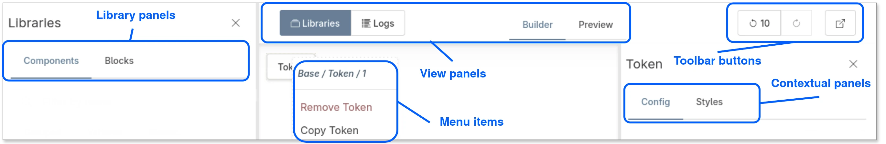

# Extend Display Builder with island plugins

> The general idea of an “Islands” architecture is deceptively simple: render HTML pages on the server, and inject placeholders or slots around highly dynamic regions […] that can then be “hydrated” on the client into small self-contained widgets, reusing their server-rendered initial HTML.

[Astro documentation](https://docs.astro.build/en/concepts/islands/)

Display Builder extensively uses HTMX's [out-of-band swapping](https://htmx.org/attributes/hx-swap-oob/) to allow an event triggered from an island to also update other islands.

There are 5 type of islands:

- `View` panels: They are displayed tabbed in the center of the toolbar, or as buttons in the start of the toolbar
- `Button`s: they are displayed as buttons in the end of the toolbar
- `Library` panels: They are displayed tabbed into the Library View panel
- `Menu` items: they are displayed in the contextual menu triggered with right-click
- `Contextual` panels: They are displayed tabbed into the contextual sidebar

Visual positioning:



## Interface

Notable methods:

- `IslandInterface::build()`: Build the renderable content of the island from state data. This renderable can be annotated by `HtmxEvents` to trigger HTTP requests
- Everything from `IslandEventSubscriberInterface`: each method is an HTMX event managed by `ApiController`. Islands receive callbacks for every state-changing operation:

  | Method | Triggered when |
  |---|---|
  | `onAttachToRoot()` | A node is added at root level |
  | `onAttachToSlot()` | A node is added into a component slot |
  | `onMove()` | An existing node is moved |
  | `onUpdate()` | A node's source configuration is updated |
  | `onDelete()` | A node is removed |
  | `onActive()` | A node becomes the focused node |
  | `onHistoryChange()` | The history pointer changes (undo / redo) |
  | `onRestore()` | The builder is restored to its last saved state |
  | `onRevert()` | An entity view override is reverted to the base display config |
  | `onSave()` | The builder state is saved to the backing config entity |
  | `onPresetSave()` | A node is saved as a reusable preset |

  The default base class (`IslandPluginBase`) returns an empty array for all events. Use `IslandReloadEventsTrait` if your island needs to do a full re-render on history/restore/revert changes.
- `PluginFormInterface::buildConfigurationForm()`: to make the island plugin configurable in the [Display Builder profile (config entity)](configuration.md)

HTMX behavior will change according to `IslandInterface::build()` return value:

- `null`: the island is not altered
- `empty`: the island is emptied

### Attributes

- `id`: Plugin ID
- `label`: The human-readable name of the plugin.
- `description`: A brief description of the plugin.
- `type` : The island type from enumeration.
- `icon`: Icon for this island. Used for View panels.

Example:

```php
namespace Drupal\display_builder\Plugin\display_builder\Island;

use Drupal\Core\StringTranslation\TranslatableMarkup;
use Drupal\display_builder\Attribute\Island;
use Drupal\display_builder\IslandPluginBase;
use Drupal\display_builder\IslandType;

#[Island(
  id: 'block_library',
  label: new TranslatableMarkup('Blocks library'),
  description: new TranslatableMarkup('List of available Drupal blocks to use.'),
  type: IslandType::Library,
)]
class BlockLibraryPanel extends IslandPluginBase {
}
```

### Keyboard support

We provide a small utility to map buttons to keyboard shortcuts to ease actions in the Display Builder.

If your Island provide a button you should use our method `\Drupal\display_builder\RenderableBuilderTrait::buildButton()` to generate your button.
This method allow a keyboard mapping as parameter. Check the class for more info.

If your island is of type `IslandType::View`, implement the `keyboardShortcuts()` method.

_Note_: There is no control on duplicate, please ensure your shortcut is not already used.
