# Available islands

There are 5 type of islands:

- `View` panels: They are displayed tabbed in the center of the toolbar, or as buttons in the start of the toolbar
- `Button`s: they a re displayed as buttons in the end of the toolbar
- `Library` panels: They are displayed tabbed into the Library View panel.
- `Menu` items: they are displayed in the contextual menu triggered with right-click.
- `Contextual` panels: They are displayed tabbed into the contextual sidebar.

Visual positioning:

Display Builder is shipped with those ones by default:

## View panels

### Libraries

Pick elements from libraries and drop them in the display.

By default, 3 libraries are available:

- Components for SDC
- Block for all other data sources for slots (field, blocks, WYSIWYG...)
- Presets for pattern presets

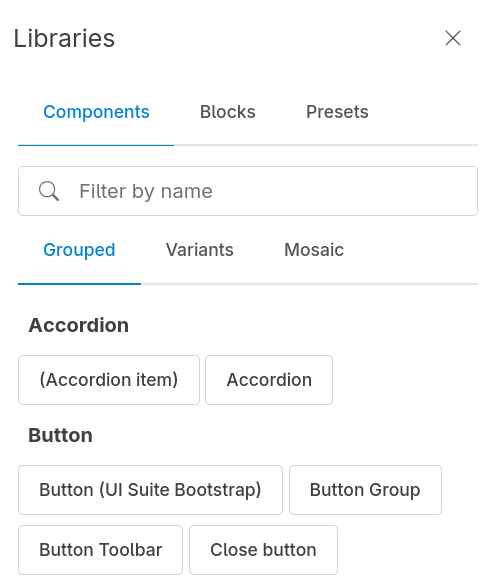

### Builder

The Display Builder main island. Build the display with dynamic preview.

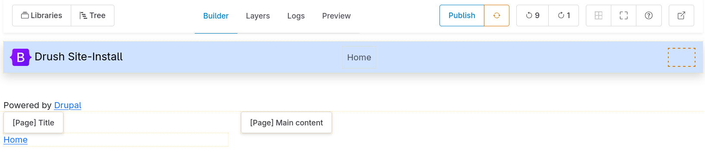

### Layers

Manage hierarchical layer view of elements without preview.

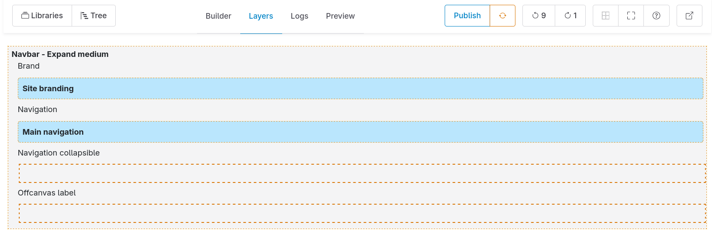

Layers is better for dropping components and blocks when the preview in the builder panel is making thinks complicated. For examples: a modal, a sliding slider, a collapsing accordion...

### Tree

Hierarchical view of components and blocks.

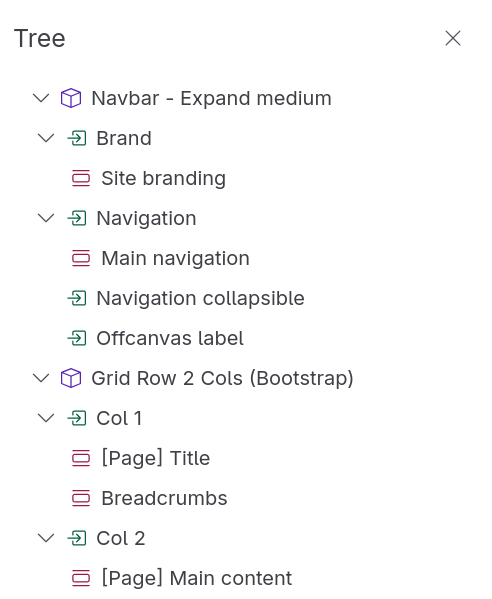

### Preview

Show a real time preview of the display.

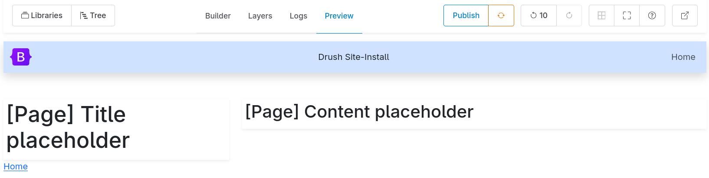

### Logs

Logs based on changes history.

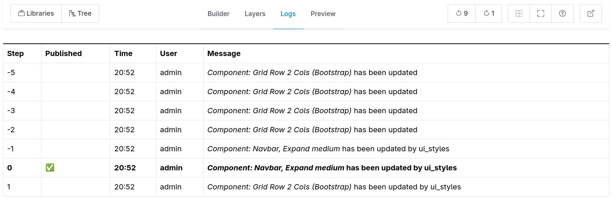

> 🚧 2025-11-09: History steps are currently limited to 10.

## Buttons

When a buttons island is made of proper button component it is possible to configure for each of them:

- to be displayed with label and icon
- to be displayed with label only
- to be displayed with icon only
- to not be displayed

### History

Undo and redo changes.

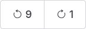

> 🚧 2025-11-09: History steps are currently limited to 10.

### State

Publish and reset the display.

With 3 available buttons:

- XXX
- XXX
- XXX (for entity view override only)

### Controls

Control the building experience.

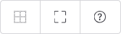

With 4 available buttons:

- Help (keyboard and more)
- Toggle full screen
- Highlight
- Theme mode selector

> 🚧 2025-07-01: Do we keep Theme mode selector?

### Real-time collaboration

See [real-time collaboration documentation](realtime-collaboration.md).

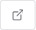

Configuration:

| Option      | Type | Default value |
| ----------- | ---- | ------------- |
| Image field | XXX  | XXX           |
| Image style | XXX  | XXX           |

### Viewport switcher

Change main region width according to breakpoints.

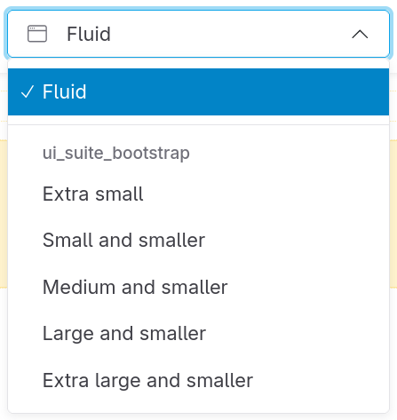

Configuration:

| Option            | Type | Default value |
| ----------------- | ---- | ------------- |
| Selector format   | XXX  | XXX           |
| Exclude providers | XXX  | XXX           |

### Back

Exit the display builder and go back to admin UI.

## Library panels

### Components

List of available components (SDC).

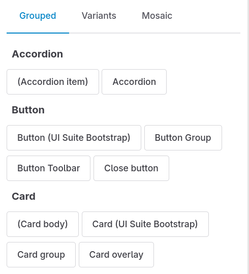

Configuration:

| Option                                 | Type | Default value |
| -------------------------------------- | ---- | ------------- |
| Exclude providers                      | XXX  | XXX           |
| Exclude by ID                          | XXX  | XXX           |
| Allowed status                         | XXX  | XXX           |
| Show components grouped                | XXX  | XXX           |
| Show components variants               | XXX  | XXX           |
| Show components mosaic                 | XXX  | XXX           |
| Include marked as excluded from the UI | XXX  | XXX           |

> 🚧 2025-11-09: Those options may change.

### Blocks

List of available blocks. XXX

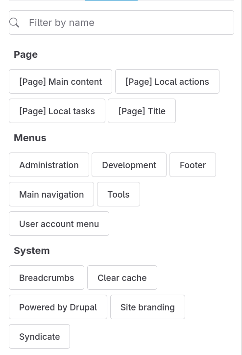

Configuration:

| Option          | Type | Default value |
| --------------- | ---- | ------------- |
| Exclude modules | XXX  | XXX           |

### Presets

See [patterns presets documentation](pattern-presets.md).

## Menu items

Available on secondary click on a block, component or slot, in Builder or Layer panels:

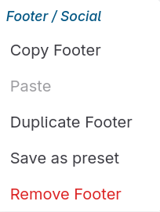

The menu title is the block, or component

HOW IS IT BUILT?

### Main actions

Actions:

| Action    | On a component | On a component slot     | On a block |
| --------- | -------------- | ----------------------- | ---------- |
| Copy      | ✅             | ✅ the parent component | ✅         |
| Paste     | ???            | ???                     | ???        |
| Duplicate | ✅             | ✅ the parent component | ✅         |

### Preset

Actions:

| Action           | On a component | On a component slot     | On a block |
| ---------------- | -------------- | ----------------------- | ---------- |
| Save as a preset | ✅             | ✅ the parent component | ✅         |

See also: Preset library.

### Delete

Remove a component or block:

| Action | On a component | On a component slot     | On a block |
| ------ | -------------- | ----------------------- | ---------- |
| Delete | ✅             | ✅ the parent component | ✅         |

## Contextual panels

### Contextual form

Configure the active component or block.

### UI Styles

Apply style utilities to the active component or block.

### UI Skins

Override CSS variables for the active component or block.

### Visibility

Set visibility conditions for the active component or block.
