# Available islands

There are 6 type of islands:

- `View` panels: They are displayed tabbed in the center of the toolbar, or as buttons in the start of the toolbar
- `Button`s: they are displayed as buttons in the end of the toolbar
- `Library` panels: They are displayed tabbed into the Library View panel.
- `Menu` items: they are displayed in the contextual menu triggered with right-click.
- `Contextual` panels: They are displayed tabbed into the contextual sidebar.
- `Floating` controls: they float over one or more `View` panels, only visible while an attached panel is the active main tab.

Visual positioning:

Display Builder is shipped with those ones by default:

## View panels

### Libraries

Pick elements from libraries and drop them in the display.

By default, 3 libraries are available:

- Components for SDC
- Block for all other data sources for slots (field, blocks, WYSIWYG...)
- Presets for pattern presets

### Canvas

The Display Builder main island. Build the display with dynamic preview.

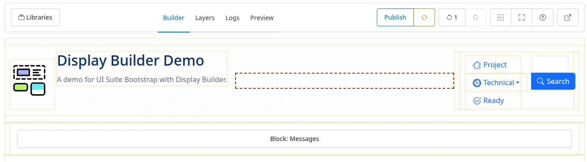

### Wireframe

Schematic hierarchical view of elements without preview.

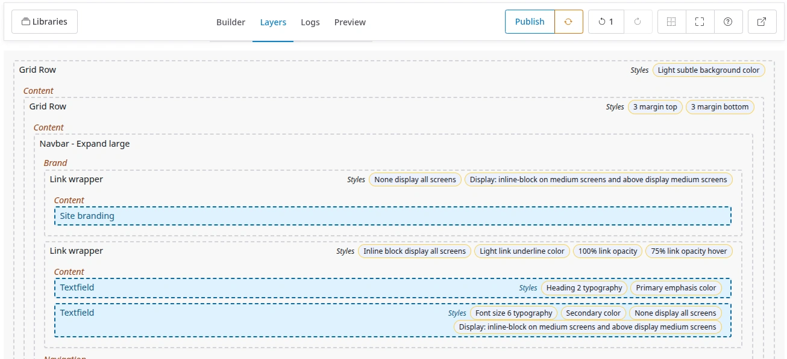

The wireframe is better for dropping components and blocks when the preview in
the canvas panel is making things complicated.  
For examples: a modal, a sliding slider, a collapsing accordion is hard to
manipulate when built.

### Scaffold

Same schematic view as the Wireframe, except that a configurable allowlist of
layout components (e.g. Bootstrap grid rows) is rendered with its real output,
so the actual layout nesting is visible at a glance. Everything else stays a
plain wireframe card.

Which components count as "layout" is theme-specific, hence a configurable
list rather than a hardcoded one — set it in the island's configuration form.

### Navigator

Hierarchical view of components and blocks.

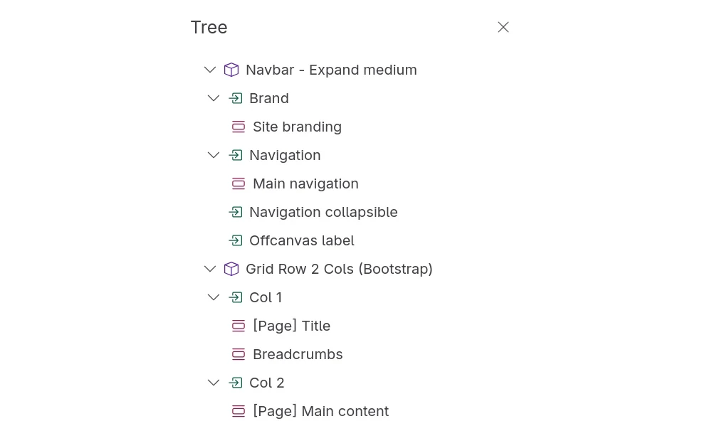

### Preview

Show a real time preview of the display.

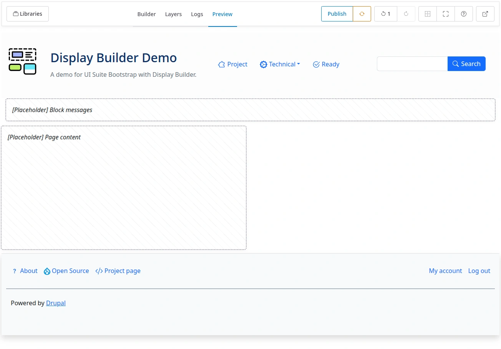

### Logs

Logs based on changes history.

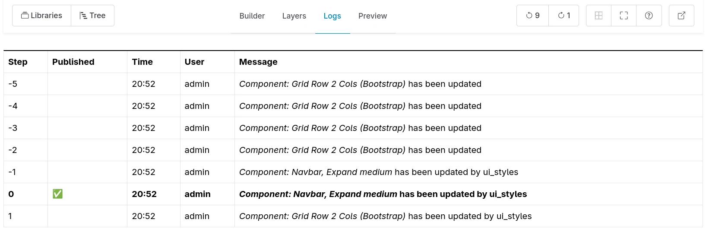

> 🚧 2025-11-09: History steps are currently limited to 10.

## Buttons

When a buttons island is made of proper button component it is possible to configure for each of them:

- to be displayed with label and icon
- to be displayed with label only
- to be displayed with icon only
- to not be displayed

### History

Undo and redo changes.

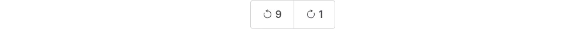

> 🚧 2025-11-09: History steps are currently limited to 10.

### State

Publish and reset the display.

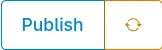

With 3 available buttons:

- Publish
- Restore (Restore to last published version)
- Revert (for entity view override only, revert to default display for this entity)

### Controls

Control the building experience.

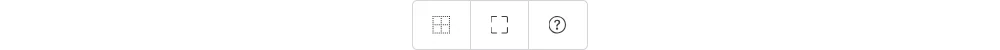

### Real-time collaboration

See [real-time collaboration documentation](realtime-collaboration.md).

### Back

Exit the display builder and go back to admin UI.

## Library panels

### Components

List of available components (SDC).

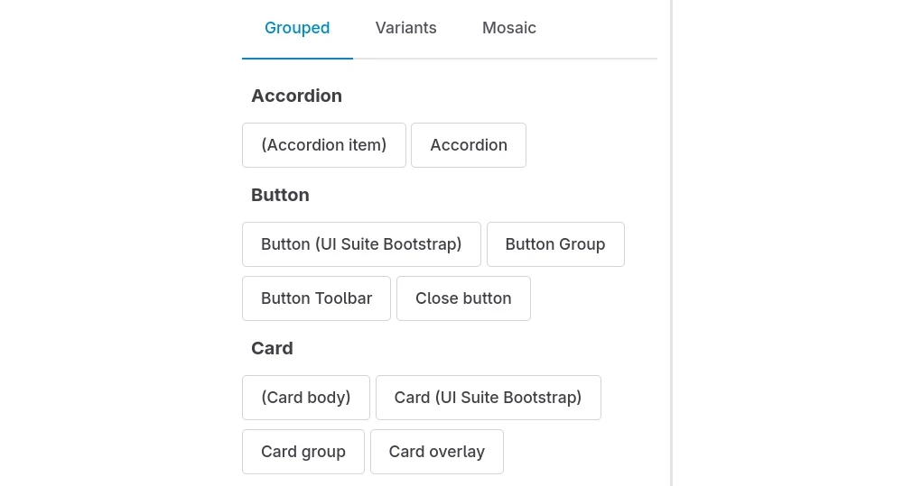

A specific configuration allow to pick available components.

### Blocks

List of available blocks.

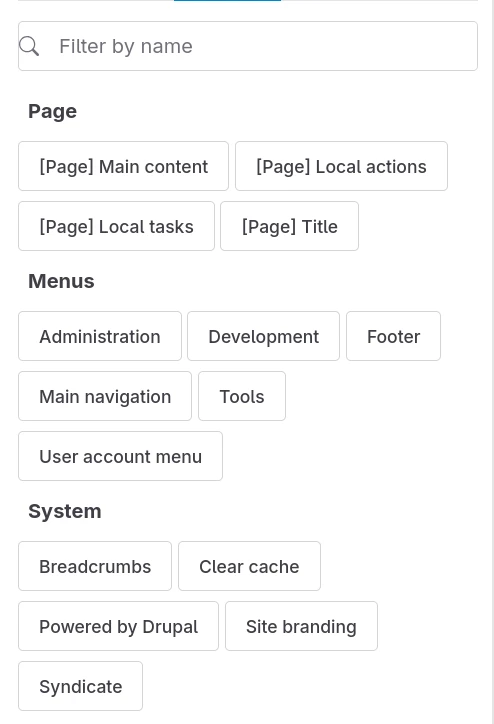

### Presets

See [patterns presets documentation](pattern-presets.md).

## Menu items

Available on secondary click on a block, component or slot, in Canvas or Wireframe panels:

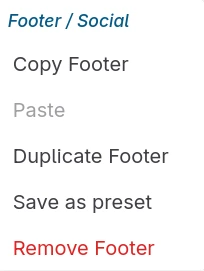

The menu title is the block, or component with tree position.

### Preset

See also: [patterns presets documentation](pattern-presets.md).

### Delete

Remove a component or block with all children.

## Contextual panels

### Contextual form

Configure the active component or block.

### Styles

Apply style utilities to the active component or block.

### Skins

Override CSS variables for the active component or block.

### Visibility

Set visibility conditions for the active component or block.

## Floating controls

A floating control is pinned to the top-left of the View panel(s) it's
attached to, below the toolbar, only visible while one of those panels is
the active main tab. Unlike Toolbar buttons, a floating control lives
alongside a specific panel's own content because it's usually meaningless
anywhere else (e.g. it depends on CSS scoped to that panel).

### Highlight

Highlight zones to ease drag and move around. Attached to the Canvas and
Scaffold panels, where highlighting has a visible effect.

### Viewport switcher

Change main region width according to breakpoints. Attached to both the
Canvas and Preview panels.

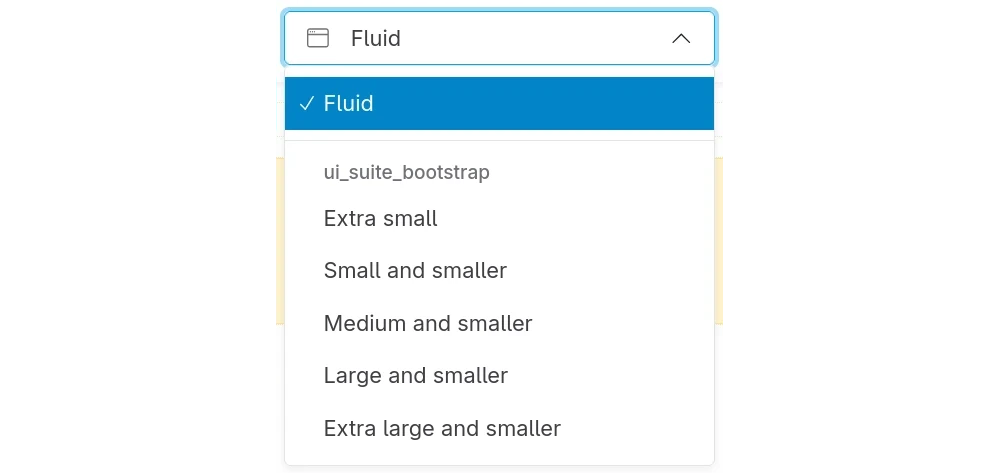

## See also

- [Configuring Display Builder](configuration.md) - Configure islands in profiles
- [Extend with island plugins](island-plugins.md) - Create custom islands
- [Pattern presets](pattern-presets.md) - Save and reuse component arrangements
- [Real-time collaboration](realtime-collaboration.md) - Work together with other
  editors
