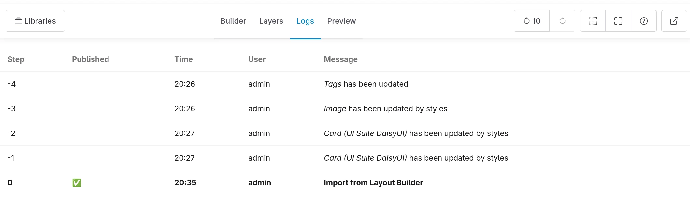
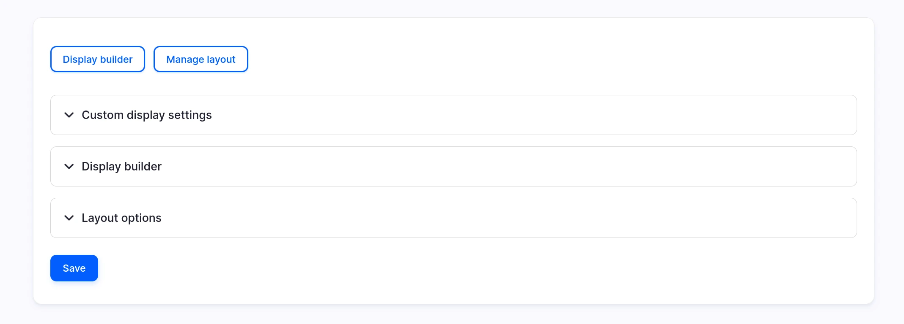

# Migration from Layout Builder

In Display Builder Entity View sub-module.

## Migration of the entity view display config entity

This migration can be triggered in two different ways:

- When the Display Builder is initialized for the first time and Layout Builder is already activated. If Layout Builder is not used for the display, it will migrate from "Manage Display" data instead.
- Each time the Layout Builder is saved.

Each migration is a full migration, overriding the current Display Builder data, and is creating a new step in Display Builder logs:

So, it is possible to undo each of them. We can have both tool installed at the same time and still using Layout Builder and keep testing Display Builder before doing the switch:

## Migration of the override content field

When an Display Builder override is initialized, there are 4 possible sources of data and we load the first in this order of priority:

- Field settings default value: the first, not because we want but because it seems Field API is forcing it. It may be the opportunity to challenge that.
- Existing Layout Builder override (only for default display): priority because we keep existing content
- Display Builder entity view display configuration: the most usual and expected situation. the scope of this ticket
- Existing Layout builder configuration (if we do [#3540048: Allow override of displays not build with display builder](https://www.drupal.org/project/display_builder/issues/3540048))

> 🚧 2025-08-26: Not ready yet See: [#3542859](https://www.drupal.org/project/display_builder/issues/3542859)

## Migration process

Layout Builder is made of sections (a flat list of layout plugins, one layout per section) and components (a flat list of block plugins, inside each layout region).

Layout builder sections:

| Section's layout plugins    | Migrated as                                                                                     |
| --------------------------- | ----------------------------------------------------------------------------------------------- |
| SDC component (UI Patterns) | ✅ SDC component                                                                                |
| Other layouts               | ❌ No proper conversion, we extract the blocks and put them as a flat list where the layout is. |

> 🚧 2025-11-11: We may add layout plugin support. See: [#3531521](https://www.drupal.org/project/display_builder/issues/3531521)

| Section's other data | Migrated as              |
| -------------------- | ------------------------ |
| UI Styles data       |  ✅ Third party settings |

Layout builder components:

| Component's block plugin     | Migrated as                                            |
| ---------------------------- | ------------------------------------------------------ |
|  SDC component (UI Patterns) | ✅ SDC component.                                      |
| Field                        | ✅ Field                                               |
| Extra field                  | ❌ No proper conversion, only a placeholder is placed. |
| Other blocks                 | ✅ Imported as they are configured.                    |

| Component's other data | Migrated as                                            |
| ---------------------- | ------------------------------------------------------ |
| Third party settings   | ✅ Third party settings.                               |
| Block title            |  ❌ Not imported because no `block.html.twig` anymore. |

### ⚠️ Note about wrapper templates

Display Builder rendering is skipping do not load `block.html.twig` and `field.html.twig`, so it does not execute `hook_preprocess_block` and `hook_preprocess_field`.

So, the modules adding third-party settings and executing those hooks will still have the form displayed in the contextual panel, but the alteration of the renderable will not be executed.

Examples of such modules:

- [Fences](https://www.drupal.org/project/fences)
- [Field Formatter Range](www.drupal.org/project/field_formatter_range)

> 🚧 2025-08-26: This may change. See: [#3534619](https://www.drupal.org/project/display_builder/issues/3534619)
