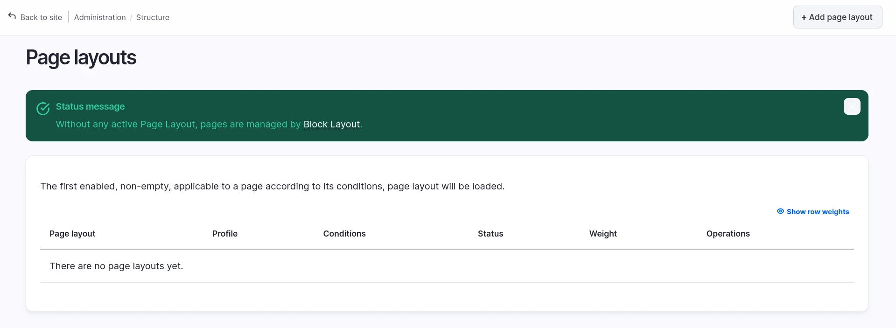
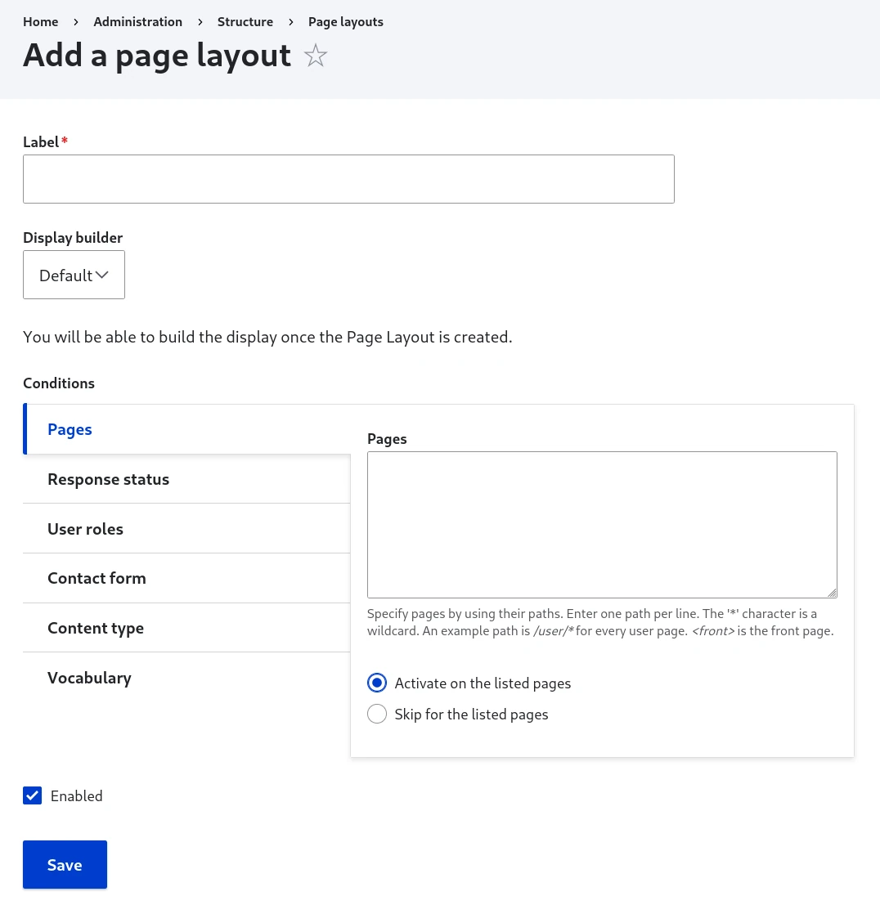
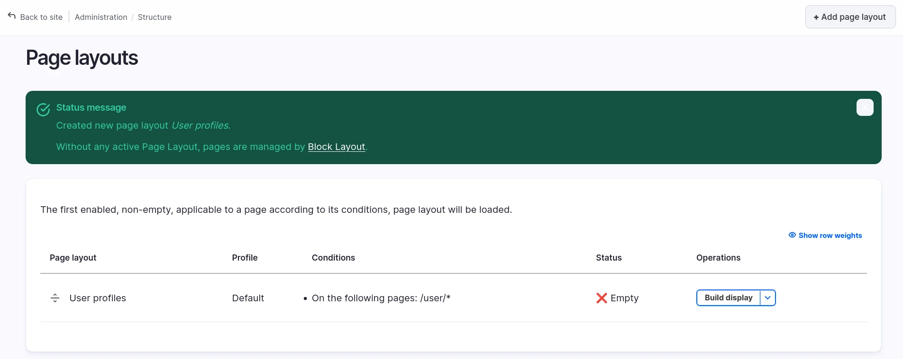
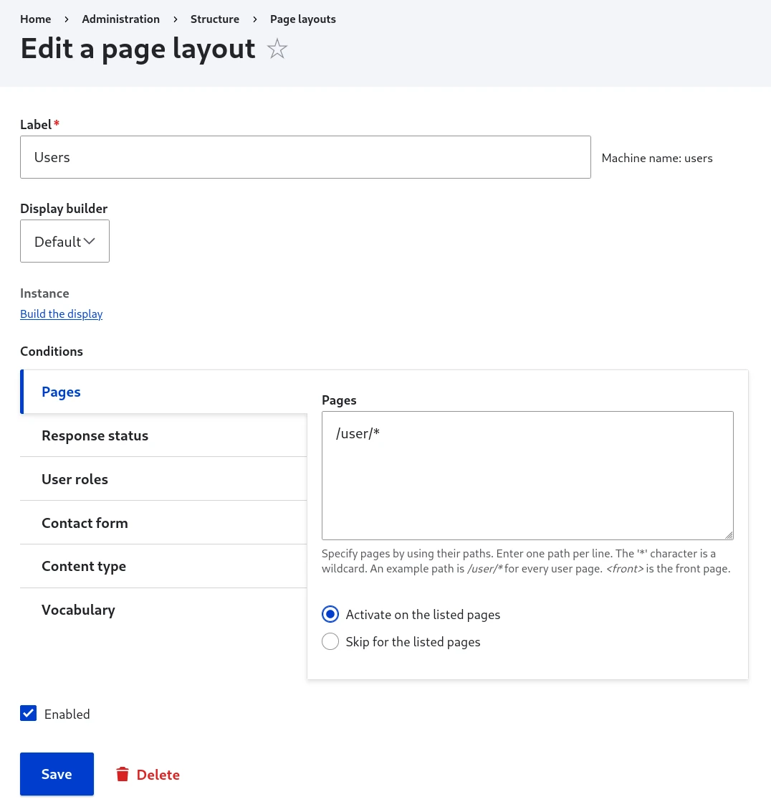
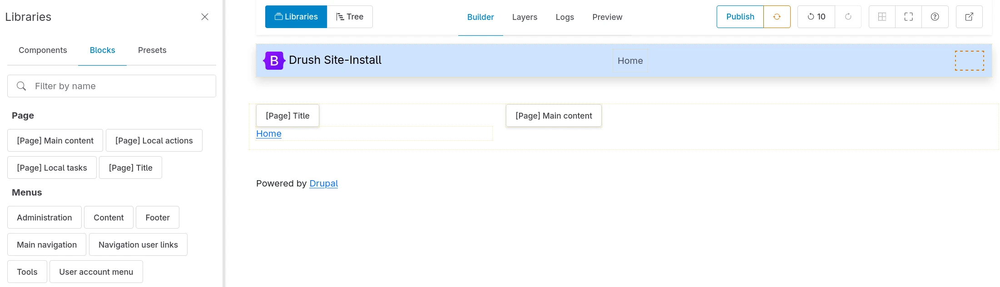
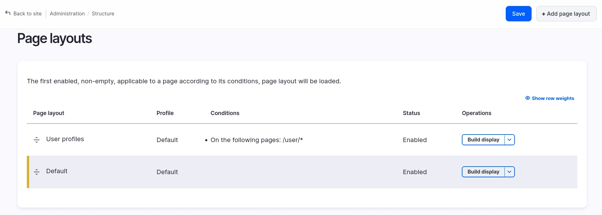

# Use Display Builder for Page Layout

As a replacement of Block Layout (`/admin/structure/block`)

> A page is assembled from several levels at once: a page layout places the
> page's main content. What fills it is a display: an entity's view display,
> or a Views display. A display can itself place another display, by
> rendering a reference field with a view mode.
>
> See [How displays nest](how-displays-nest.md).

## Activate

You need `display_builder_page_layout` module.

There is no page layout activated by default. You need to create your owns in Administration > Structure > Page layouts (`/admin/structure/page-layout`):

Until a page layout is both enabled and built, _Block Layout_ keeps building your
pages. The overview page tells you which pages are still uncovered and links to
the action that takes them over.

## Default and conditional page layouts

The overview page holds two kinds of page layout. The difference is whether the
layout carries conditions:

| Kind | Conditions | Applies to | Create it with |
|------|------------|------------|----------------|
| Default page layout | None | Every page that no other layout matches | **Create the default page layout** |
| Conditional page layout | One or more | Only the pages its conditions match | **Add page layout** |

A page layout with no condition *is* the default one. There is no separate flag
to set, and no configuration key to export.

!!!note
    The **Create the default page layout** action link disappears once a default
    page layout exists, because Display Builder offers one at a time. Editing a
    page layout never converts it between the two kinds.

## Create the default page layout

Select **Create the default page layout** to open
`/admin/structure/page-layout/add-default`. The form opens on a reminder of what
this layout is for:

> This layout has no condition, so it applies to every page no other layout
> matches. It is checked last, which leaves conditional layouts free to take over
> the pages they target.

Then:

1. Select a **Starting point**.
2. Select a **Profile**.
3. Keep **Enabled** selected.
4. Select **Save**.

This form asks for no label and no conditions. Display Builder names the layout
`Default`, with the machine name `default`.

## Create a conditional page layout

Select **Add page layout** to open `/admin/structure/page-layout/add`, then:

1. Enter the **Label**. The machine name derives from it.
2. Select a **Starting point**.
3. Select a **Profile**.
4. Set your **Conditions**.
5. Keep **Enabled** selected.
6. Select **Save**.

Condition plugins is the heart of the form:

- Drupal Core already provides a few plugins. **Pages** is the most commonly used. **Language** is visible only if at least two languages are activated in the site.
- You can add more conditions by activating or developing Drupal modules.
- Most condition plugin utilize contexts. The context will be the one of the page visitors will load.
- All conditions must be met for a page layout to load.

Configure at least one condition. Saving without any is refused:

> Configure at least one condition. A page layout with none applies to every
> page, which is what the default page layout is for.

## Starting points

The **Starting point** decides what Display Builder places in the layout when it
is created. It appears only while you create a layout that has nothing in it yet,
because a layout is seeded once. Editing a layout later never shows the field
again, and neither does duplicating a layout that already carries content: the
duplicate keeps what it was copied from.

| Starting point | Offered on | What it places |
|----------------|------------|----------------|
| **Start from your current site** | The default page layout only | The blocks currently placed in your front-end theme, in their matching regions, still rendered by that theme's page template |
| **Minimal Drupal page** | Both forms | Breadcrumbs, status messages, page title, tabs, primary actions and the main content, without the theme page shell. Help is placed too when the Help module is installed |
| **Blank** | Both forms | Nothing at all |

**Start from your current site** defaults to selected on the default page layout,
and **Minimal Drupal page** on a conditional one.

!!!warning
    **Start from your current site** is a one-time copy. Later changes in _Block
    Layout_ don't show up in the page layout. Replace the contents of each region
    with components as you go, then remove the theme page shell to take full
    control of the page.

Because **Minimal Drupal page** and **Blank** leave out the theme page template,
the page is unstyled until you add layout components.

!!!tip
    To start from a layout you already built, duplicate it from the page layouts
    list instead.

## Use Display Builder

You will be able to build the display once the Page Layout is created.

From the overview page:

Or from the edit page:

The Display Builder instance is a normal one with the starting point preloaded (but not already saved) and some sources specific to the *Page* context:

- `[Page] Title`
- `[Page] Main content`
- `Theme page (from active theme)`: the theme's page shell, with its regions as slots

Tabs, primary admin actions, breadcrumbs, messages and help are regular core
blocks, picked from the **Blocks** library like any other block.

Other modules can provide Source plugins, and [you can add your owns](source-plugins.md).

## Manage

All _Page layouts_ are manageable from the overview page:

Conditional _Page layouts_ are draggable and orderable. Order is important. Don't
forget to save. The default page layout sits apart at the bottom of the list,
with no drag handle, because its position is fixed.

From top to bottom, checking conditional _Page layouts_ one by one, the first one
which is both:

- enabled with non-empty Display Builder
- applicable according to all its conditions in the context of the page

will be loaded for the page, as a replacement of both:

- _Block Layout_ admin UI
- the page regions defined in the theme (with the related `page.html.twig`
  template)

It is better to keep the most specific ones at the top, and the more generic at
the bottom.

!!!tip
    Order matters! Position your most specific condition checks at the top, since
    Display Builder will use the first matching page layout. Generic layouts should
    be at the bottom as fallbacks.

The default page layout is checked last, whatever its weight. Pages that no
conditional layout matches fall through to it.

If no Page layout matches at all, _Block Layout_ still manage the page. While no
default page layout is both enabled and built, the overview page says so and
points at what's missing:

- No default page layout exists yet. Create one to take the uncovered pages over.
- The default page layout is empty. Build its display.
- The default page layout is disabled. Enable it.
- Several layouts carry no condition (imported configuration can do that), and
  none of them is both enabled and built. Enable one and build its display.

Once a default page layout is both enabled and built, the message disappears.

!!!note
    Admin pages are out of scope for now: no page layout replaces them.

Disabling a page layout is one way to stop it matching: the pages it used to cover fall back to the next matching layout below it, or to _Block Layout_ and the theme's own regions if none do. Nothing about the previously overridden pages is lost by disabling; it only stops taking them over. The same goes for the default page layout: disable it from its edit form, or delete it from the overview page, and the uncovered pages go back to _Block Layout_. The **Create the default page layout** action link returns after a deletion.

You can build a page layout entirely while it is disabled, then enable it once it is ready: only viewing a page is gated by the enabled status, editing and publishing the display are not. This is a normal, supported way to prepare a layout without exposing an unfinished one to visitors.

## See also

- [How displays nest](how-displays-nest.md) - What a page layout owns, and what fills it
- [Available islands](islands.md) - The panels and controls you build with
- [Display Builder profiles](configuration.md) - Configure UI profiles
- [Migration from Layout Builder](migration-from-layout-builder.md) - Move an existing site over
