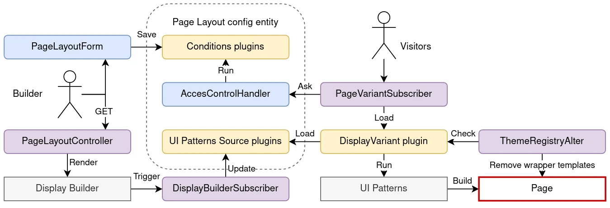

# Use Display Builder for Page Layout

As a replacement of Block Layout (`/admin/structure/block`)

## Activate

You need `display_builder_page_layout` module.

There is no page layout activated by default. You need to create your owns in Administration > Structure > Page layouts (`/admin/structure/page-layout`):


## Create and edit

Adding a page layout is simple:

- Set the Label
- Pick your Display builder profile
- Set your conditions


Condition plugins is the heart of the form:

- Drupal Core already provides a few plugins. "Pages" is the most commonly used. "Language" is visible only if at least two languages are activated in the site.
- You can add more conditions by activating or developing Drupal modules.
- Most condition plugin utilize contexts. The context will be the one of the page visitors will load.
- All conditions must be met for a page layout to load.

## Use Display Builder

You will be able to build the display once the Page Layout is created.

From the overview page:


Or from the edit page:


The Display Builder instance is a normal one with some data preloaded (but not already saved) and some sources specific to the "Page" context:

- `[Page] title`
- `[Page] Main content`
- `Primary admin actions`
- `Tabs`


Other modules can provide Source plugins, and [you can add your owns](island-plugins.md).

## Manage

All _Page layouts_ are manageable from the overview page:


_Page layouts_ are draggable and orderable. Order is important. Don't forget to save.

From top to bottom, checking _Page layouts_ one by one, the first one which is both:

- enabled with non-empty Display Builder
- applicable according to all its conditions in the context of the page

will be loaded for the page, as a replacement of both:

- _Block Layout_ admin UI
- the page regions defined in the theme (with the related `page.html.twig` template)

It is better to keep the most specific ones at the top, and the more generic at the bottom.

If no Page layout matches, _Block Layout_ still manage the page.

## Under the hood

Each page is its own config entity

- `profile`: the Display builder profile (config entity) in use last time the config was saved
- `sources`: a UI Patterns 2 sources tree

Example:

```yaml
id: users
label: Users
weight: -9
profile: default
sources: [...]
conditions:
  request_path:
    id: request_path
    pages: /user/1
    negate: '0'
```

Overview:


