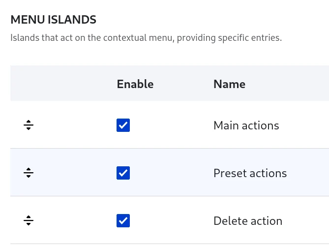
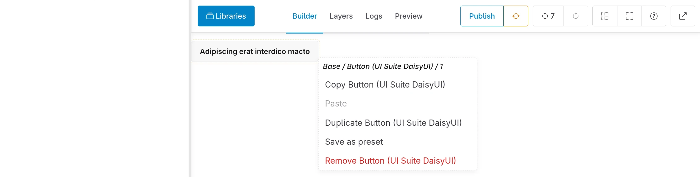
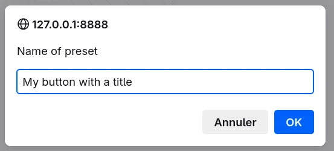
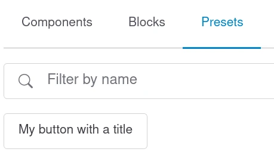
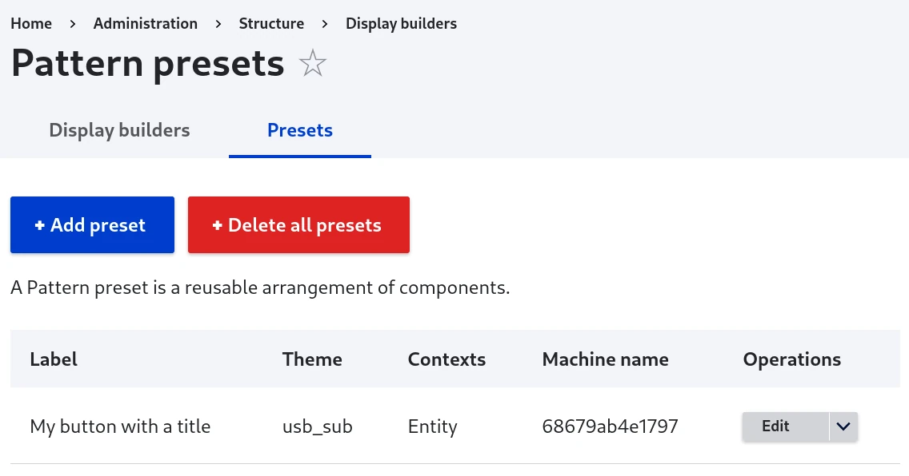

# Pattern preset

A pattern preset is a reusable arrangement of components, because:

- "Pattern" is the design systems term for "an arrangement of components for a specific purpose" (not to be confused with "UI Patterns" module which was previously using "patterns" term for "components")
- "Preset" is what is actually happening under the hood: saving and reusing those arrangements

They must not be confused with UI components:

- Components are the individual building blocks that a UI is made out of. They're context-agnostic and can be used anywhere within an app. They are SDC plugins.
- Patterns are the ways these components are used within a UI. They're relevant only in certain context They are config entities.

## Activate

"Preset actions" menu island must be enabled in the Display Builder's profile:



## Create a pattern preset

You can click on any element of the builder panel and select "Save as preset":



Your preset must have a name:



## Use a pattern preset

The pattern preset is now available in the `Patterns Library` panel if:

- it shares the same context(s) (Page, Content, Entity, Field, Field item, View...) as the current Display Builder:
- the Drupal theme used when creating the pattern preset is activated



> 🚧 2025-07-01: Context-aware yet and dependency checks are not implemented yet. [#3534190](https://www.drupal.org/project/display_builder/issues/3534190)

## Presets management from admin UI

You need `ui_patterns_ui` module enabled to have access to `/admin/structure/display-builder/preset`:



> 🚧 2025-07-01: Context-aware yet and dependency checks are not implemented yet. [#3534190](https://www.drupal.org/project/display_builder/issues/3534190)
> 🚧 2025-07-01: Group is not used in `Patterns Library` panel yet. [#3534217](https://www.drupal.org/project/display_builder/issues/3534217)

## Under the hood

Pattern presets are config entities:

- `id`: Entity ID
- `label`: The human-readable name of the entity.
- `description` and `group`: metadata, editable only from the admin UI
- `theme`: the active theme when the pattern preset was created
- `sources`: a UI Patterns 2 sources tree

Example:

```yaml
id: 68679ab4e1797
label: "My button with a title"
description: ""
group: ""
theme: usb_sub
sources: [...]
```

> 🚧 2025-07-01: Context-aware yet and dependency checks are not implemented yet. [#3534190](https://www.drupal.org/project/display_builder/issues/3534190)

This source merge the state tree with the current state tree at the position where the source is “called”.

So, once the data is merged, its is not sync anymore with the source data. If updated, it will not alter the previous uses.
