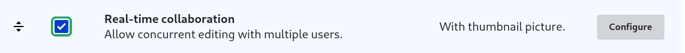

# Real-time collaboration

## Activate

The feature is available as soon as the "Real-time collaboration" island is attached to the profile:

## Use

The island is showing the faces of the users which did a change the last 10 minutes.

If no users, or only the current user, were active the last 10 minutes, the island is not displayed.

Anyway, the feature is always available: each user must see the changes made by others with a 2 seconds delay maximum.

The loop is executing three checks in this order:

- is there a change? if not, wait 2 seconds and start again
- is it done by someone else? if not, wait 2 seconds and start again
- is the change made the last 3 seconds? if not, wait 2 seconds and start again

If all three are OK, a stream is sent with the updated HTML fragments to replace.

## Under the hood

We use the [SSE extension of HTMX](https://htmx.org/extensions/sse/) with the `EventStreamResponse` [introduced in Symfony 7.3](https://symfony.com/blog/new-in-symfony-7-3-simpler-server-event-streaming)
