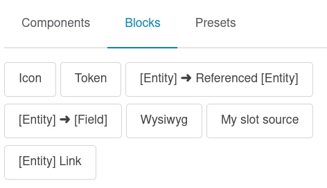
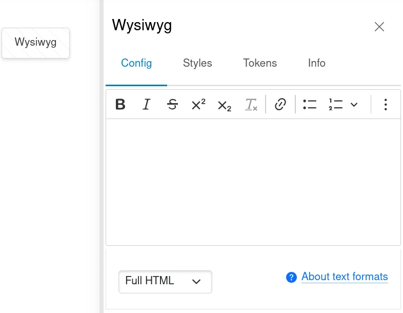

# Extend Display Builder with source plugins

Source plugins are managed by UI Patterns 2. See [UI Patterns 2 documentation](https://project.pages.drupalcode.org/ui_patterns/3-devs/1-source-plugins/).

## Source plugin for slots

A source plugin targeting`slot` prop type:

```php
namespace Drupal\my_module\Plugin\UiPatterns\Source;

use Drupal\Core\StringTranslation\TranslatableMarkup;
use Drupal\ui_patterns\Attribute\Source;
use Drupal\ui_patterns\SourcePluginBase;

#[Source(
  id: 'wysiwyg',
  label: new TranslatableMarkup('My slot source'),
  prop_types: ['slot']
)]
class WysiwygWidget extends SourcePluginBase {
}
```

.. will show up in the _Block Library_ panel:



> 🚧 2025-07-01: "[Entity] ➜ [Field]" will be flatten. [#3529260](https://www.drupal.org/project/display_builder/issues/3529260)

Source configuration from `PluginSettingsInterface::settingsForm()` is available in the contextual sidebar. For example:



> 🚧 2025-07-01: Sidebar title is not dynamic yet [#3531253](https://www.drupal.org/project/display_builder/issues/3531253)

### Source plugins for props

They are displayed in the component form managed by UI Patterns 2. Display Builder is doing nothing specific here.
