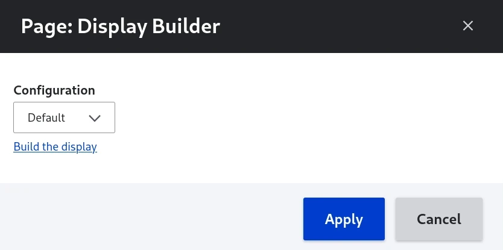

# Use Display Builder with Views

Drupal's Views module combines two distinct roles: query building and display
building. Display Builder focuses on the display building aspect, providing a
more intuitive interface for organizing and configuring the view's display
regions.

## Overview

Display Builder provides a nicer way of using, positioning & configuring View's
display regions:

- Exposed form
- Attachment before & Attachment after
- Header & Footer areas
- Rows
- Pager & More

Visual representation:

## Activate

You need `display_builder_views` module.

On the view, Display Builder can be activated in **Other**:

You can pick the builder you want according to your permissions:

## Use Display Builder

Once you have submitted your display builder selection, a link is available:

We have access to Views related sources for slots in the _Blocks Library_ panel:

View Title source is also available for string prop:

!!!note
    Previews and source configuration directly from Display Builder are still being
    developed. See the related issues for updates on these features.

> 🚧 2025-08-26: Previews are not working yet. See [#3542796](https://www.drupal.org/i/3542796)

> 🚧 2025-08-26: We are not able to configure the sources directly from Display Builder yet. See [#3533043](https://www.drupal.org/i/3533043)

## See also

- [Display Builder islands](islands.md) - Learn about available UI components
- [Pattern presets](pattern-presets.md) - Reuse component arrangements across
  views
- [Entity view displays](entity-displays.md) - Similar display building for entity
  views
