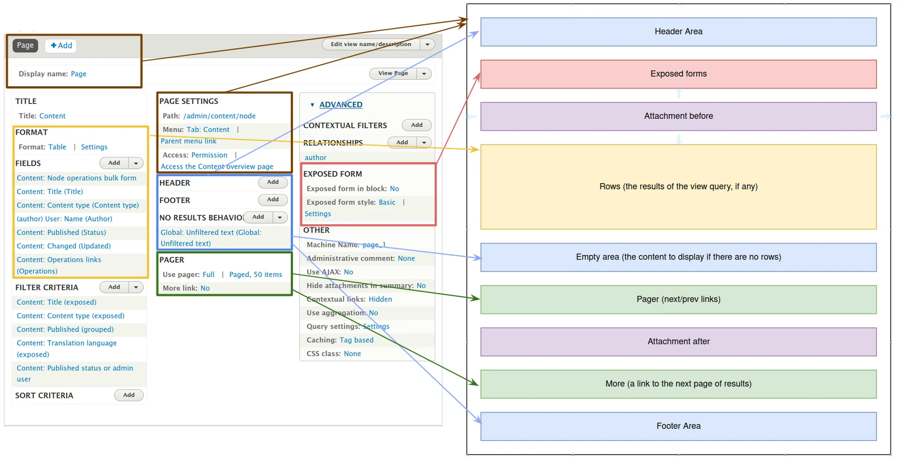
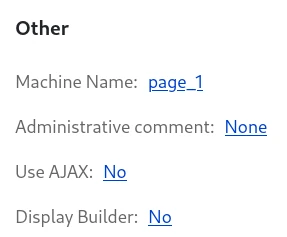
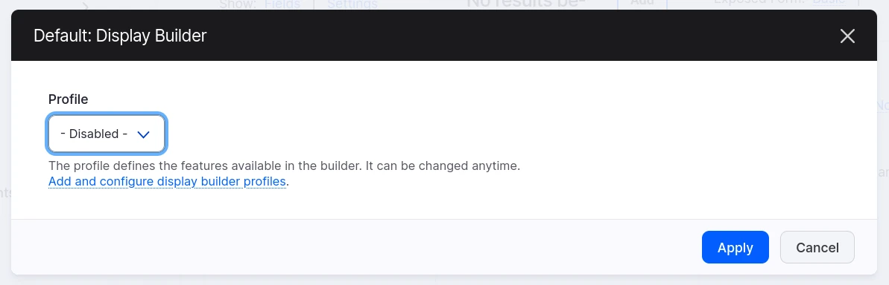
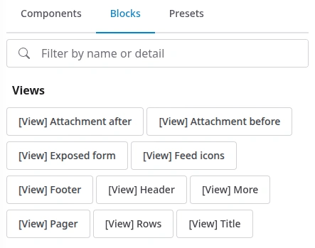
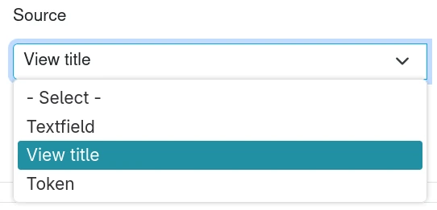

# Use Display Builder with Views

Drupal's Views module is both a query builder and a display builder:

- **query building** is done with filter, sort, contextual filters and relationships plugins. Display Builder is not dealing with them
- **display building** is done with style, pager, area, exposed form... plugins. Display Builder is not managing them directly but is interacting with them.

Display Builder is providing a nicer way of using, positioning & configuring View's display regions:

- Exposed form
- Attachment before & Attachment after
- Header & Footer areas
- Rows
- Pager & More

Visual representation:



## Activate

You need `display_builder_views` module.

On the view, Display Builder can be activated in "Other":



You can pick the builder you want according to your permissions:



> 🚧 2025-07-01: The UI of this pop-in may change.

## Use Display Builder

We have access to Views related sources for slots in the _Blocks Library_ panel:



View Title source is also available for string prop:



## Under the hood

Display Builder is a `display_extender` plugin with those properties:

- `display_builder`: the display builder config entity in use last time the config was saved
- `instance`: ID of the instance from the Drupal State API
- `sources`: a UI Patterns 2 sources tree

> 🚧 2025-07-01: `instance` may be removed [#3534215](https://www.drupal.org/project/display_builder/issues/3534215)

Example:

```yaml
id: articles
label: Articles
module: views
display:
  page_1:
    id: page_1
    display_title: Page
    display_plugin: page
    position: 1
    display_options:
      title: Articles
      path: articles
      pager: {}
      exposed_form: {}
      empty: {}
      style: {}
      header: {}
      footer: {}
      display_extenders:
        display_builder:
          display_builder: default
          instance: views_6861421654810
          sources: [...]
```
